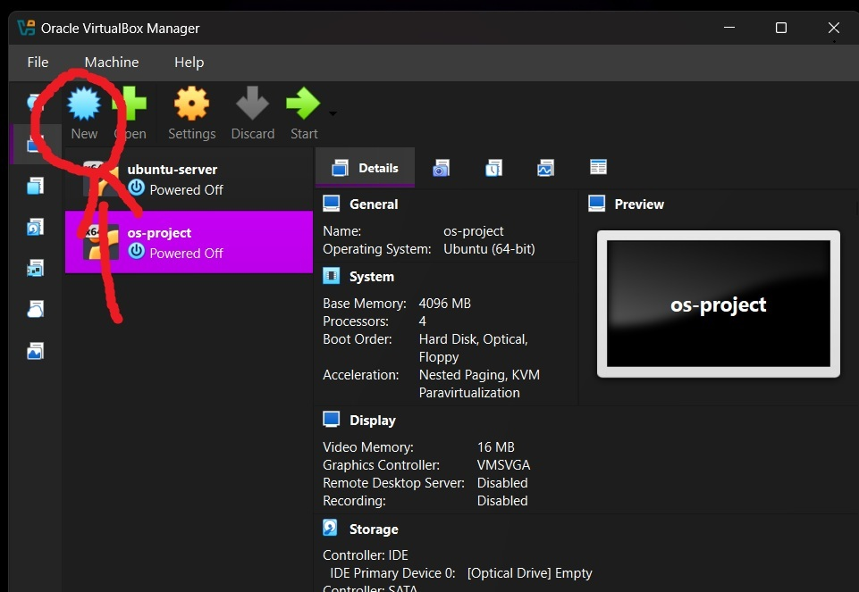
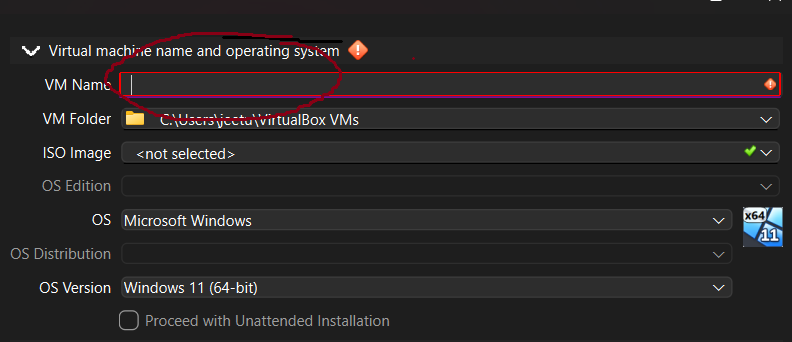
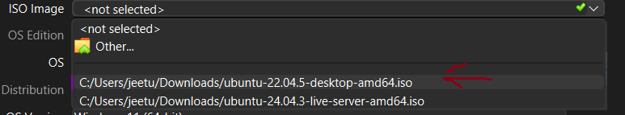
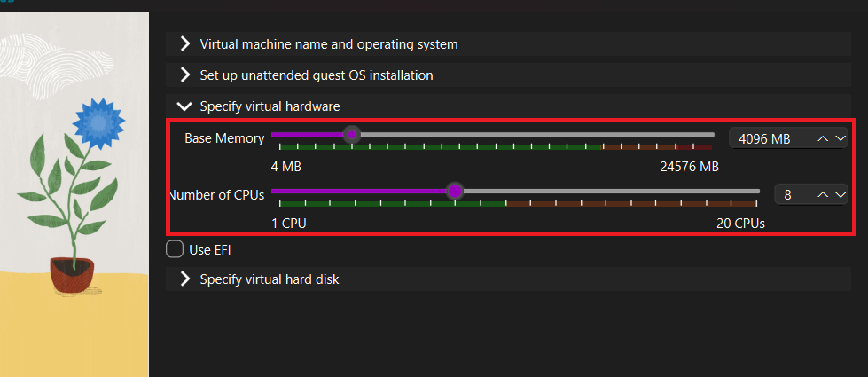
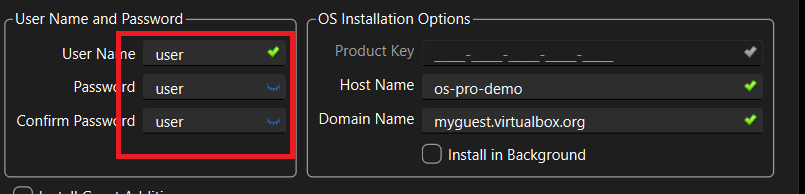
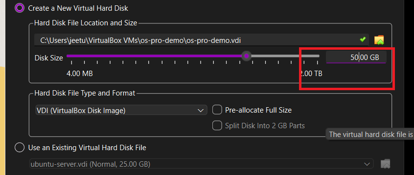

# IDS LSM Project

This project shows how to add a custom IDS (Intrusion Detection System) using Linux Security Module (LSM) hooks in Linux 6.8.

## 1) What is IDS and what is LSM?

- IDS: A system that watches activity and reports suspicious behavior.
- LSM: A Linux kernel framework where security modules can attach hooks at sensitive points, like file open, exec, and ptrace.

In this project:
- `ids_lsm.c` registers custom LSM hooks.
- The hooks log events to a kernel buffer.
- Logs are exposed through `/proc/ids_monitor`.
- `ids_monitor.c` is an optional terminal UI to display those logs.

Current hooks implemented in `security/ids/ids_lsm.c`:
- `file_open` via `ids_file_open` (monitors sensitive file access like `/etc/shadow`)
- `bprm_check_security` via `ids_bprm_check` (monitors executable launches)
- `ptrace_access_check` via `ids_ptrace` (blocks cross-user ptrace attempts)

Important:
- This IDS is built into the kernel image, not loaded as a separate module.
- So you verify with `/sys/kernel/security/lsm`, not `lsmod`.

## 2) What files are in this repo?

- `security/ids/ids_lsm.c`: IDS LSM source code
- `security/ids/Makefile`: build file for IDS source
- `security/Kconfig`: adds `CONFIG_SECURITY_IDS`
- `security/Makefile`: includes `ids/` in security build
- `install_ids_kernel.sh`: setup automation script
- `ids_monitor.c`: optional ncurses userspace monitor

Project structure:

```text
.
├── ids_monitor.c             # Userspace monitor (ncurses)
├── install_ids_kernel.sh     # Automation script
├── screenshots/              # Installation guide images
└── security/
	├── ids/
	│   ├── ids_lsm.c         # Core LSM logic
	│   └── Makefile          # Sub-directory build rules
	├── Kconfig               # Modified to include IDS option
	└── Makefile              # Modified to include ids/ directory
```

## 3) Prerequisites

Before starting, choose one environment:

- Option A (without VM, direct install): Use Ubuntu 22.04 LTS (64-bit) directly on your machine.
- Option B (secure environment): Use Windows host + Oracle VM VirtualBox + Ubuntu 22.04 VM.

Download Ubuntu 22.04 from:

- https://releases.ubuntu.com/22.04/

Recommended minimum VM resources for kernel build:

- 4 CPU cores (8 is better)
- 4 GB RAM minimum (8 GB recommended)
- 50 GB disk

## 4) Secure setup on Windows using VirtualBox (with screenshots)

If you are on Windows and want isolation, create an Ubuntu 22.04 VM in VirtualBox before continuing.

### Step A: Open VirtualBox and create a new VM

Click New in Oracle VM VirtualBox Manager.



### Step B: Enter VM name and OS details

- Set a VM name (example: os-project).
- Set OS type to Linux and Ubuntu (64-bit).
- Keep unattended install disabled if you want manual control.



### Step C: Select Ubuntu 22.04 ISO

Choose the Ubuntu 22.04 desktop ISO downloaded from the official releases page.



### Step D: Set CPU and RAM

- RAM: at least 4096 MB (increase this if your host system has available RAM)
- CPUs: at least 4 (8 recommended if your system allows)



### Step E: Set user and password

- Create a user (example: user)
- Keep a password you can remember



### Step F: Configure virtual disk size

Set disk size to at least 50 GB.



### Step G: Complete VM creation and start installation

Start the VM and complete Ubuntu 22.04 installation.

For VM users, use root and add sudo permission manually:

```bash
su
visudo
```

Add this line in `visudo` (replace `user` with the exact VM username you created in Step E):

```text
user ALL=(ALL:ALL) ALL
```

Important: The username in `visudo` must exactly match the VM username.


Then continue with the IDS setup steps below from inside the Ubuntu VM.

## 5) Full setup from cloning the repo

### Step A: Clone this project

**Use this if you want to fork this repo and work on your own copy**

```bash
cd ~
git clone <your-github-repo-url> ids-lsm-share
cd ids-lsm-share
```

**Use this if you want to clone this repo directly**

```bash
cd ~
git clone https://github.com/jeetumodi/IDS.git ids-lsm-share
cd ids-lsm-share
```

### Step B: Get Linux 6.8 source (required)

This repo contains IDS files, not the full Linux source tree. Download Linux 6.8 separately:

```bash
cd ~
git clone --depth 1 --branch v6.8 https://git.kernel.org/pub/scm/linux/kernel/git/torvalds/linux.git linux-6.8
```

### Step C: Copy IDS files into Linux source tree

Note: The `cp` commands below overwrite Linux source files in `~/linux-6.8/security/`.
Create backups first:

```bash
cp ~/linux-6.8/security/Kconfig ~/linux-6.8/security/Kconfig.bak
cp ~/linux-6.8/security/Makefile ~/linux-6.8/security/Makefile.bak
```

```bash
cd ~/ids-lsm-share
mkdir -p ~/linux-6.8/security/ids

cp security/ids/ids_lsm.c ~/linux-6.8/security/ids/
cp security/ids/Makefile ~/linux-6.8/security/ids/
cp security/Kconfig ~/linux-6.8/security/Kconfig
cp security/Makefile ~/linux-6.8/security/Makefile
```

### Step D: Run automatic setup (recommended)

Use the installer script from this repo. It installs dependencies, configures kernel options, builds, installs, and updates GRUB:

```bash
cd ~/ids-lsm-share
chmod +x ./install_ids_kernel.sh
KERNEL_DIR=~/linux-6.8 ./install_ids_kernel.sh
```

### Step E: Reboot and select custom kernel

```bash
sudo reboot
```

In GRUB Advanced options, select the new custom kernel once.

### Optional: Make GRUB menu appear on every reboot

If you want to always see the GRUB menu at startup (so kernel selection is easy each time), run:

```bash
sudo cp /etc/default/grub /etc/default/grub.bak
sudo nano /etc/default/grub
```

In that file, set:

```text
GRUB_TIMEOUT_STYLE=menu
GRUB_TIMEOUT=5
```

Then apply changes:

```bash
sudo update-grub
```

Quick verification:

```bash
grep -E '^GRUB_TIMEOUT_STYLE=|^GRUB_TIMEOUT=' /etc/default/grub
```

If needed, restore original config:

```bash
sudo cp /etc/default/grub.bak /etc/default/grub
sudo update-grub
```

## 6) Verify IDS is active

After boot:

```bash
uname -r
cat /sys/kernel/security/lsm
cat /proc/ids_monitor
```

Expected:
- Kernel version shows your newly built kernel release.
- `ids` appears in `/sys/kernel/security/lsm`.
- `/proc/ids_monitor` exists and shows logs (or empty stream initially).

## 7) Optional: run terminal monitor UI

```bash
cd ~/ids-lsm-share
gcc ids_monitor.c -o ids_monitor -lncurses
./ids_monitor
```

## 8) What should you test?

Generate a few actions and re-check logs:

```bash
cat /etc/shadow >/dev/null
sh -c 'echo test'
cat /proc/ids_monitor
```

If IDS is working, new log lines should appear.

## 9) Common mistakes

- Setting `CONFIG_LSM` only in shell does nothing unless written in `.config`.
- Using smart quotes instead of normal quotes in config values.
- Trying to verify with `lsmod` for a built-in LSM.
- Forgetting to boot the newly installed kernel from GRUB.

## 10) If system does not boot custom kernel

1. Reboot and choose older working kernel from GRUB Advanced options.
2. Rebuild initramfs for the custom kernel:

```bash
cd ~/linux-6.8
sudo depmod -a "$(make -s kernelrelease)"
sudo update-initramfs -u -k "$(make -s kernelrelease)"
sudo update-grub
```

3. Reboot and try custom kernel again.
